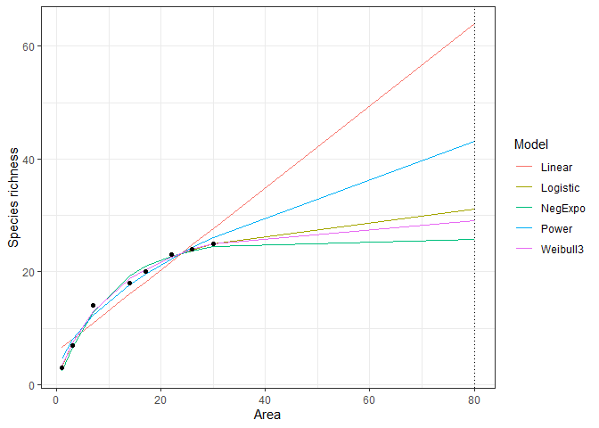

README
================
Tom Matthews
2022-12-31

## Preamble

Presented here is the code, data and results for the paper:

Matthews, T.J. & Aspin, T.W.H. (2019) Model averaging fails to improve
the extrapolation capability of the island species–area relationship.
Journal of Biogeography, 46, 1558–1568.

Through subsequent analyses and data checking, we have corrected small
data entry errors where they have been found. In a small number of
cases, we have subsequently found that the source paper authors
published updated / more extensive versions of the datasets used; in
these cases, we have replaced the original version. As such, the
datasets presented here differ slightly from those used in the original
publication. In addition, since the paper was published in 2019, there
have been numerous updated made to the ‘sars’ R package, including
replacing models and improving the fitting algorithms. As such, the
results presented here may differ slightly from those published in the
original paper, although the main conclusions are unchanged.

The R script and source code are stored in the ‘R code’ directory. The
datasets are stored in a list called ‘Datasets’ (saved in the drive
“Data” within the repository), where each element is a dataframe
(representing a dataset) with two columns: area (a) and number of
species (s). Area is in ha. Dataset numbers match \*\*\*.

``` r
setwd("C:\\Users\\Tom\\Desktop\\ISAR_Extrap")

Datasets <- readRDS("Data\\Datasets.rds")

length(Datasets)
```

    ## [1] 120

## Results

### POW vs. MMI

When a th value of 0.5 was used, the power model provided the best fit
to the most (filtered) datasets (n = 29), followed by the linear model
(n = 21), and then the Monod (n = 19) and logarithmic models (n = 16)
(see Table 1), according to AICc.

The full results of the main extrapolation and prediction analysis are
provided in Table S2 in Appendix S2. In contrast with our hypothesis,
the power model provided the most accurate prediction of the richness of
the largest island (i.e. the lowest absolute LEE value) in 69 cases
(58%), with the multi‐model averaged curve providing the more accurate
prediction in the remaining 51 cases (42%). The median LEE value of the
power model was 0.04 (95% quantiles = −0.32 and 0.31), whilst the median
LEE value of the multi‐model curve (LEE‐MMI) was 0.03 (95% quantiles =
−0.35 and 0.74). However, as LEE values could be both positive and
negative, the median of the absolute LEE values provides a better
summary of the extrapolation capability: the median of absolute LEE‐POW
values was 0.08 (95% quantiles = 0.01 and 0.34), whilst the median of
absolute LEE‐MMI values was 0.10 (95% quantiles = 0.01 and 0.74). Both
the power model (61% of LEE‐POW values were positive) and the
multi‐model averaged curve (60% of LEE‐MMI values were positive) had a
slightly greater tendency to over predict the observed richness.

The confidence intervals were on average narrower for the power model
predictions (median 95% confidence interval width = 18) than for the
multi‐model averaged curve predictions (median 95% confidence interval
width = 78) (Table S3 in Appendix S2). The confidence intervals around
the multi‐model averaged curve predictions were sometimes very large
(i.e. spanning multiple orders of magnitude; see Table S3 in Appendix
S2).

### Predictions from 20 individual models

When the extrapolation predictions from all 20 ISAR models were
considered, in addition to the multi‐model averaged curve, the power
model provided the most accurate prediction of the richness of the
largest island in 11 cases, with the multi‐model averaged curve
providing the most accurate prediction in five cases. The Extended Power
2 (see Table 1) model provided the best prediction the most times, with
12 cases (the results for all models are provided in Table 1).

### GAMs

The full GAM (i.e. the GAM with all predictors) had a lower AIC value
(−121.9) than an equivalent standard linear regression model (−115.4);
this provides additional justification for our use of GAMs. When LEE‐POW
was used as the response variable in a GAM model selection analysis, the
best model contained Ascale, Sscale, Lat. and Smin (Table 2). A plot of
the smoothers for these four variables is provided as Figure 2. The
effective degrees of freedom of the smoothers for Ascale and Lat. were
one, indicating that these smoothers were straight lines; increasing
Ascale resulted in decreasing LEE‐POW, while the opposite pattern was
true for Lat (Figure 2). The Sscale and Smin relationships were more
complex (Figure 2), but increasing Sscale resulted in an approximate
increase in LEE‐POW. However, there was a reasonable degree of model
uncertainty as the best model had an AICc weight of only 0.20, and there
were two additional models within 2 delta AICc units of the best model
(Table 2). In addition, the adjusted R2 value of the best model was low
(0.20). Ascale (0.98), Sscale (0.95) and Smin ( 0.81) had quite high
relative importance values, whilst the values for the remaining
predictors were all lower (Table 2).

For 18 of the ISAR models, the relative fit of a model to the filtered
dataset (i.e. the model’s AICc weight) was a poor predictor of a model’s
extrapolation accuracy (measured using the LEE metric). In only two
cases (for the Power Rosenzweig and Extended Power 1 models; see Table 1
for model descriptions) was the AICc weight a significant predictor of a
model’s absolute LEE value (Table S4 in Appendix S2).

### Sensitivity analyses

The choice of th value did not change the overall qualitative results.
The power model provided the more accurate prediction in 65 (54%) and 72
(61%; when a th value of 0.7 was used there was one dataset for which no
models could be successfully fitted) cases when th values of 0.3 and 0.7
were used, respectively (see Tables S5 and S6 in Appendix S2). In
regards to the power model validation sensitivity test, there were 23
datasets for which the power model failed one of the validation checks.
However, removing these 23 datasets and re‐running the prediction
analysis using the remaining 97 datasets did not change the overall
qualitative results: the power model provided the most accurate
prediction in 55 cases (57%). Finally, rerunning the prediction analysis
after excluding the linear model from the multi‐model averaged curve
resulted in a slight increase in the number of cases where the
multi‐model averaged curve provided the more accurate prediction (60 of
120 cases), but the general picture remained the same.

#### Table 1

| cv                                                  |       V2 | V1            |
|:----------------------------------------------------|---------:|:--------------|
| CSV-Baldi & Kisbenedek (1999)noniso.csv             |  47.5835 | Invertebrates |
| CSV-Baldwin & Bradfield (2007) Nimpkish ISARnew.csv |  50.3506 | Plants        |
| CSV-Baldwin & Bradfield (2007) Sayward ISARnew.csv  |  50.3506 | Plants        |
| CSV-Baz et al (1995) ISARnew.csv                    |  40.6339 | Invertebrates |
| CSV-Behle (1978)new.csv                             |  38.4341 | Vertebrates   |
| CSV-Benassi et al (2007) ISARnoniso.csv             |  41.8190 | Vertebrates   |
| CSV-benedick et al (2006)new.csv                    |   5.5466 | Invertebrates |
| CSV-Blake and Carr (1984)noniso.csv                 |  40.5738 | Vertebrates   |
| CSV-Bogich et al (2012)noniso.csv                   | -37.1199 | Invertebrates |
| CSV-Boyle & Smith (2010)noniso.csv                  |  -2.7720 | Vertebrates   |
| CSV-brotons and herrando (2001)noniso.csv           |  41.3213 | Vertebrates   |
| CSV-Brown (1971).csv                                |  37.6784 | Vertebrates   |
| CSV-Brown (1978) birdsnoniso.csv                    |  37.6784 | Vertebrates   |
| CSV-Brown (1978) mammalsnoniso.csv                  |  37.6784 | Vertebrates   |
| CSV-Browne (1981) fish ISARnoniso.csv               |  42.7389 | Vertebrates   |
| CSV-Browne (1981) molluscs ISARnoniso.csv           |  42.7389 | Invertebrates |
| CSV-Browne (1981) plankton ISARnoniso.csv           |  42.7389 | Invertebrates |
| CSV-Calvilloe et al (2010) ISARnew.csv              |  21.4092 | Invertebrates |
| CSV-Carter-Lovejoy (1982) mammals ISARnew.csv       |  43.4868 | Vertebrates   |
| CSV-Charles & Ang (2010)noniso.csv                  |   4.9196 | Vertebrates   |
| CSV-Cieslak & Dombrowski (1993)noniso.csv           |  51.9194 | Vertebrates   |
| CSV-Crooks et al (2001)new.csv                      |  32.7642 | Vertebrates   |
| CSV-Crowe (1979).csv                                |  41.7937 | Plants        |
| CSV-Dalecky et al (2002)noniso.csv                  |   4.8857 | Vertebrates   |
| CSV-Darlington (2001)noniso.csv                     |  -4.2572 | Invertebrates |
| CSV-Davis et al (1988) 2 ISARnew.csv                |  32.2893 | Vertebrates   |
| CSV-Davis et al (1988)new.csv                       |  32.2893 | Vertebrates   |

#### Table 2

TABLE 2 The results of the generalized additive model selection.

| Model | Amin | Ascale | Lat. |   Ni | Smin | Sscale | Taxon | Delta | Weight |
|:------|-----:|:-------|:-----|-----:|:-----|:-------|------:|------:|-------:|
| 1     |   NA | \+     |      |   NA |      | \+     |    NA |  0.00 |   0.16 |
| 2     |   NA | \+     | \+   |   NA |      | \+     |    NA |  0.63 |   0.11 |
| 3     |   NA | \+     |      |   NA | \+   | \+     |    NA |  0.89 |   0.10 |
| 4     |   NA | \+     | \+   |   NA | \+   | \+     |    NA |  1.88 |   0.06 |
| RI    | 0.26 | 0.98   | 0.4  | 0.25 | 0.37 | 0.99   |  0.19 |    NA |     NA |

#### Figure 1

<!-- -->

FIGURE 1 The varying species richness predictions of five ISAR models.
Each of the five models (see Table 1) was fitted to a simulated
archipelago consisting of eight islands of varying size (1, 3, 7, 14,
17, 22, 26 and 30; undefined units) and richness (3, 7, 14, 18, 20, 23,
24 and 25). These model fits were then used to predict the richness of
an island of size 80 (grey dotted line)

#### Figure 2

 FIGURE 2 Fitted smoothers from a
generalized additive model showing the partial effects of Ascale,
Latitude, Smin and Sscale on the LEE‐POW values. The fitted values have
been shifted in each plot by adding the model intercept (0.04) value
(using the shift argument in the plot.gam R function). The effective
degrees of freedom for each smoother are: Ascale (1.00), Latitude
(1.00), Smin (2.90) and Sscale (1.00). The dashed lines represent the
standard error curves (two SE above and below). Each LEE‐POW value
relates to the accuracy of a prediction of the number of species on a
habitat island using the power model. For each of 119 habitat island
datasets, the largest island and all islands larger than half the size
of the largest island were removed and the power model was fitted to the
filtered dataset and extrapolated.
